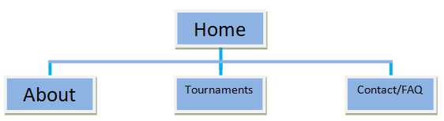
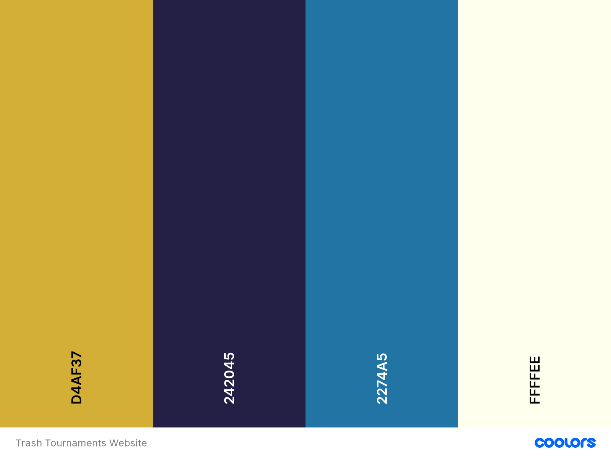

<h1 align="center">Trash Tournaments Discord Advertisement Site</h1>

[View a live version of the site here.](https://joeyyscott.github.io/Trash-Tournaments/)

Trash Tournaments is a personal community discord aimed at helping peope improve at the game Rocket League. It is owned by me and a few friends and for Milestone Project 1 why not create a site that will get used?

Am I responsive screenshot

___

## Contents

- [**User Experience Design (UXD)**](<#user-experience-(uxd)>)

  - Project Goals
  - Content Requirements
  - Importance/Feasibility chart
  - First time user/Site owner goals
  - What's needed now and in future?
  - Website Structure
  - Design Decisions from UXD
    - Colour Scheme
    - Typograhpy
    - Imagery
  - Wireframes
  - Design Changes

- [**Features**](#features)

- [**Deployment**](#deployment)

- [**Citations**](#citations)
  
  ___

## User Experience (UXD)

### Project Goals

The idea is to create a static front-end only website consisting of 5 pages to advertise a non competitive rocket league tournament discord. The basis for this idea is being a veteran rocket league player myself I know firsthand the bad experiences a user can encounter. The discord itself is run by me. I consulted with a few friends and proposed the idea to them to give me an idea of requirements, needs and what they would expect/desire from such a product.

### Content Requirements

+ Build an online presence for Trash Tournaments and construct the brands style based on the logo whilst following a minimalistic design

    **Strategy for requirement**:
    
    The only graphic that has been given is the discord logo. Due to this, it’s the main inspiration for the design as it returns you to the home page. The suggested colour scheme is; white, blue and gold. These 3 colours will create a consistent style for the website and thus the brand.

    I’ve conducted interviews with the administrators as well as a few current players which provided the information to fill the home page, about section and FAQ. I also received information on how the tournaments will be structured time zone wise which provides a basis for the tournaments timetable page.

+ Create a reason to return to the site and showcase users who’ve done the same

    **Strategy for requirement**: 
    
    Reinforce the discords ethos and purpose across all pages so users are reminded of other first timers and how they wanted to return. In the header under the name; provide a few comments from players about why they stayed/came back.

    The about page will be the main strategy for this point. Having comments from active players starting rank vs current rank, reason for joining and a feedback paragraph on their experience as a whole. This will allow a new user to see that there is always room for improvement at all ranks and encourage them to get involved (and stay!) through the positive learning experiences displayed. There will also be a “user profiles coming soon!” underneath the header on all pages. Clicking this will activate a call to action modal where a user will be presented with all the relevant information and how to stay in touch.

+ What is culturally appropriate and would content type would be relevant?

    **Strategy for requirement**: Establishing a solid brand image from the discords ethos, active players and purpose creates the welcoming environment for new users. This paired with people who are looking to improve provides a mentally positive and encouraging environment associated with the brand. I’ve added a quick overview of the about page on the homepage to further reinforce that environment.

    People playing rocket league either own a console, pc or both. 66.6% (console) of players may not own a PC/laptop. This is an important consideration as this is potentially 2/3rds of the target audience. Due to this the website will be constructed with a mobile first design approach to utilize the time a potential user spends on the site by providing only the essential information whilst maintaining the style, layout and intuitive browsing. This allows all users (mobile, tablet, PC) to receive a similar but optimized experience which maintains the brand image across all devices. The navigation menu will be central fixed to the top with taglines to provide additional info, however on mobile devices the menu will collapse into a ‘hamburger’ icon as these devices have less screen real estate. All versions will include eye catching fonts, a fitting colour scheme (active pages, links, hovers, etc) and utilizing modern conventions consistently to maintain a satisfying user experience. Using a sleek design will catch the attention of new visitors as it looks professional and provides a positive brand image.

+ What does the user expect from such a website?

    **Strategy for requirement**: 
    + **What is this?** - Product branding/style must be consistent across all pages and easily recognizable throughout the website.
    + **Expectations of User** - Active player base, promising reviews, information on all critical areas. Tournament times/dates, how to get involved and a way to contact the owners should they be stuck.
    + **Does it offer what I want?** - Friendly environment to improve, higher ranks willing to help, finding people to play with who have similar interests. (wanting to improve, play as a team, etc)
    + **Does it encourage new users and existing users to stay/return?** - All call to action buttons and links open up in a new tab to maintain user retention. On the homepage there’s evidence of all the content within the site in a shortened version; current users, users learning experiences in about page, a variety of information/content presented to promote the discords ethos and community which entices new users as they can see others already benefitting from it.

### Importantance/Feasibility chart

Opportunity/Problem | Importance | Viability/Feasibility
:-------- |:--------:|:--------:
A. Creation of online presence | 5 | 5
B. Showcase current users | 4 | 4
C. Increase player base | 3 | 3
D. User profiles | 1 | 2
E. Promote discords purpose/welcoming environment | 5 | 5
F. User posted testimonials | 1 | 2

### First Time User Goals

+ As a **first time user** I want to be able navigate through the whole site smoothly.
+ As a **first time user** I want to understand the purpose of the site upon loading it.
+ As a **first time user** I want to be able to easily view information about the discord on any screen size.
+ As a **first time user** I want to easily be able to find a community to play rocket league with.
+ As a **first time user** I want to find out if other people have had experience with this website/discord.
+ As a **first time user** I want to find information about upcoming tournaments
+ As a **first time user** I want to be able to contact the site owners for more information

### Site Owner Goals

+ As a **site owner** I want the landing page (index.html) to clearly provide all information needed about the sites purpose and what is available.
+ As a **site owner** I want any user to receive the correct information for the viewport they’re currently on.
+ As a **site owner** I want users to clearly see there are people willing to play with and help them improve at rocket league.
+ As a **site owner** I want an organized, intuitive navigation system across all pages.
+ As a **site owner** I want users to see input from people who’ve participated and their respective ranks.
+ As a **site owner** I want to include information of upcoming tournaments with conversions for major time zones.
+ As a **site owner** I want any user to be able to easily contact me with their details and query for more information.

### What's need now and in future?

+ What do they say they need?

    The discord owners want an aesthetically pleasing and professional website to reinforce their ethos and give a concise but detailed description of everything the discord has to offer. A section in the about page to contain player reviews of the discord to provide reassurance that anyone, even a Bronze player can and has benefitted from the experience. This includes their rank, learning experience and their recommendation out of 10 which attracts new users and allows current users to be inspired and motivated by other’s experiences.

+ What do they actually need?

    The discord owners could have their needs and more fulfilled by using a mobile first approach to a fully responsive website which would allow for easy navigation, use and no diminished experiences on all viewport sizes. Clear simplistically designed pages and sections to draw attention to all the features offered (about, tournament info and FAQ/contact) which allows new users to become familiarized with the environment in use by the current players and encourage them to get involved. Within the tournaments section, display dates and times in the most common time zones to allow the majority of users to be catered for. Include a description for the type of tournament (regular, extra modes, training) to ensure users are receiving the correct information for where they wish to get involved.

+ What don’t they know they need

    Setup guides for discord, private matches which provide key information to help any potential users wanting to get involved who may lack this knowhow and to enable all users (mobile, tablet and PC) to find, view and use the site easily without compromising design.

    Other features further down the line will allow the website to provide a more complete user experience by incorporating user profiles, tournament stat tracking, merchandise, user posted testimonials. These will all help with user satisfaction, retention and familiarisation with the discords brand.

### Website Structure

This website will use a conventional hierarchical tree structure to utilize the three click rule of thumb. This means that a user will never be more than 3 clicks than the content they want to access. Upon loading it will bring you to the home page (index.html) where you can view a brief rundown of the entire site; small sections dedicated to each page within the site providing a brief overview of what that page is.

Each page will include a central navigation system to provide links to a minimum of 3 other pages and providing information related to the page title. There will be a subtle but noticeable indicator as to the current page the user is browsing. The nav bar is subject to responsive design and on small/mobile devices will condense into a ‘hamburger’ icon that will have a toggle to view the nav menu and its associated links. As mentioned earlier this will save screen real estate and keep to conventions users are expecting.
<h2 align="center">Diagram for tree structure</h2>
<h3 align="center"></h3>

To maintain a good user experience, consistent styling throughout the site and using interaction design elements that utilize user’s expectations of conventions.
+ The most notable being every page of the site contains the official Logo in the top left of the header as this is the first spot most users look when loading a website. Clicking the logo will return user to the homepage (index.html).
+ Each nav bar link that is hovered over will provide a subtle visual cue to the user to show where they are selecting and similar cues to show their current location on the site.
+ The general style, colour scheme, font and design elements will maintain consistency of the discords branding to allow the user to easily familiarize with the layout/structure of the site efficiently and intuitively.
+ The footer section of the website contains 3 sections:
    + Section 1 takes up 33% width and contains the message “Still stuck?” and a link to the Contact/FAQ page with an appropriate tagline.
    + Section 2 takes up 33% width and contains the main link for the website, the invite to the discord with an appropriate tagline.
    + Section 3 takes up 33% width and contains icons to various social media links (opens in new tab to maintain user retention)
+ The input elements of the form within the Contact/FAQ page have required attributes and email field contains additional validation; needs “@” and “.” to be present for submission.

###  Design Decisions from UXD

#### Colour Scheme

After a quick Google search I found a great tool called [coolors.co](coolors.co) which I used to create this colour scheme. From the strategy section we want it to be blue, white and gold. I picked the gold and darker blue from the logo given, I decided to use a second lighter shade of blue (using the sites generator) to create visual identification to the user about state changes of elements. The final colour chosen was off-white to provide a neutral colour for text.

#### Images

The Trash Tournaments logo image is owned by me as I created it. The other images used on this site are taken from the game Rocket League which is owned by Epic Games.

#### Typography

To keep with the intended consistent styling I have used the same two fonts from the Google Fonts library. I picked Lobster Two Bold 700 italic for the headings and titles as it’s the same font used in the logo. I’m using Arvo 400 as my secondary font for the content text as it was a complimentary font to Lobster Two. Font weights may be subject to change once coding has started.

### Wireframes

|                                                  Home                                                    |                                                     About                                                |                                                  Tournaments                                                   |                                              FAQ/Contact                                               |
| :------------------------------------------------------------------------------------------------------: | :------------------------------------------------------------------------------------------------------: | :------------------------------------------------------------------------------------------------------------: | :----------------------------------------------------------------------------------------------------: |
| [Mobile](https://github.com/JoeyyScott/Trash-Tournaments/blob/master/assets/wireframes/index-mobile.png) | [Mobile](https://github.com/JoeyyScott/Trash-Tournaments/blob/master/assets/wireframes/about-mobile.png) | [Mobile](https://github.com/JoeyyScott/Trash-Tournaments/blob/master/assets/wireframes/tournaments-mobile.png) | [Mobile](https://github.com/JoeyyScott/Trash-Tournaments/blob/master/assets/wireframes/faq-mobile.png) |
| [Tablet](https://github.com/JoeyyScott/Trash-Tournaments/blob/master/assets/wireframes/index-tablet.png) | [Tablet](https://github.com/JoeyyScott/Trash-Tournaments/blob/master/assets/wireframes/about-tablet.png) | [Tablet](https://github.com/JoeyyScott/Trash-Tournaments/blob/master/assets/wireframes/tournaments-tablet.png) | [Tablet](https://github.com/JoeyyScott/Trash-Tournaments/blob/master/assets/wireframes/faq-tablet.png) |
|     [PC](https://github.com/JoeyyScott/Trash-Tournaments/blob/master/assets/wireframes/index-pc.png)     |     [PC](https://github.com/JoeyyScott/Trash-Tournaments/blob/master/assets/wireframes/about-pc.png)     |     [PC](https://github.com/JoeyyScott/Trash-Tournaments/blob/master/assets/wireframes/tournaments-pc.png)     |     [PC](https://github.com/JoeyyScott/Trash-Tournaments/blob/master/assets/wireframes/faq-pc.png)     |

### Design changes from project inception

+ Originally I was going to use the standard navbartoggler icon from BootStrap but decided to use a font awesome icon inside my span element of the button. Doesn't seem to affect my site as it stands, I used a trash can icon to build the brands presence.
    + EDIT: I ended up designing a nav logo using the 3 lines of a conventional hamburger icon and have used this instead.
---

## Features

To be added.

---

## Deployment

### Deploying to Github pages

To achieve deployment I used this process:

1. After pushing my project to GitHub, I navigated and logged into the GitHub site.
2. I then went to my repositories and selected the one associated to this project: [Trash Tournaments Repository](https://github.com/JoeyyScott/Trash-Tournaments)
3. On the main repository bar I clicked "Settings" and scrolled to "Github Pages".
4. Under "Source" dropdown box I selected "Master Branch" and clicked "Save".
5. After the page refreshed I returned to the "Github Pages" section for the live link to the published site.

The live link for the site is here: [https://joeyyscott.github.io/Trash-Tournaments/](https://joeyyscott.github.io/Trash-Tournaments/)

## Citations

This section includes all areas/sections of code and properties I was unaware of. I've also included citations from where I've adapted/changed code used in the projects throughout my course as figured it was better practice to state as such to avoid any penalizations or copyright violations.

+ The timeline used in tournaments page is an adapted version of the timeline used in Code Institutes mini project for Rosies Resume. I've never coded this feature before but felt it would make an effective way to display the tournaments information.

#### [Back to top](#contents)

