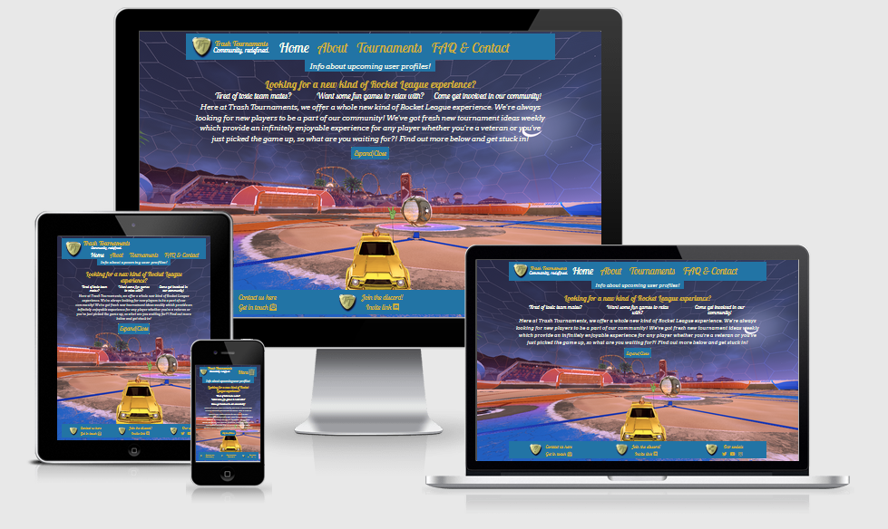
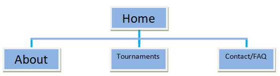
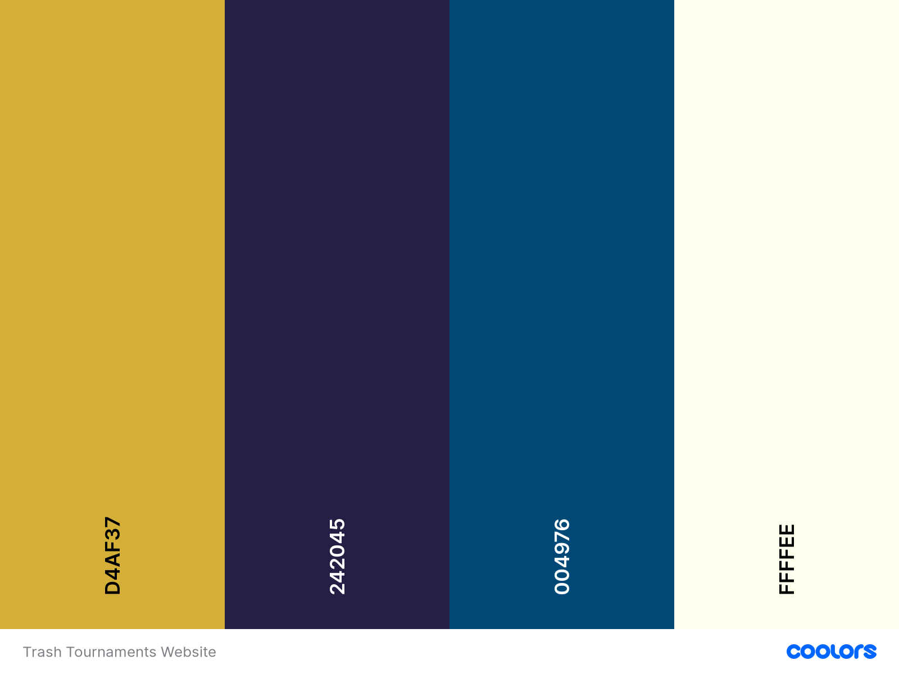

<h1 align="center">Trash Tournaments Discord Advertisement Site</h1>

[View a live version of the site here.](https://joeyyscott.github.io/Trash-Tournaments/)

I have created this project (Milestone project 1) as part of my Full Stack Web Development course with [Code Institute](https://codeinstitute.net/).

Trash Tournaments is a personal community discord aimed at helping people improve at the game [Rocket League](https://www.rocketleague.com/). It is owned by me and a few friends. For Milestone Project 1 I thought why not create a site that will get used?



___

## Contents

- [**User Experience Design (UXD)**](<#user-experience-design>)

  - [Project Goals](<#project-goals>)
  - [Content Requirements](<#content-requirements>)
  - [Importance and Feasibility chart](<#importance-and-feasibility-chart>)
  - [User Stories](<#user-stories>)
  - [What is needed now and in future?](<#what-is-needed-now-and-in-future>)
  - [Website Structure](<#website-structure>)
  - [Design Decisions from UXD](<#design-decisions-from-uxd>)
    - Colour Scheme
    - Images
    - Typography
  - [Wireframes](<#wireframes>)
  - [Design Changes](<#design-changes>)

- [**Features**](#features)

- [**Technologies**](#technologies)

- [**Testing**](#testing)

- [**Deployment**](#deployment)

- [**Credits**](#credits)
  
  ___

## User Experience Design

### Project Goals

The idea is to create a static front-end only website consisting of 4 pages to advertise a non competitive [Rocket League](https://www.rocketleague.com/) tournament discord. The basis for this idea is being a veteran Rocket League player myself I know first-hand the bad experiences a user can encounter. The Discord itself is run by me. I consulted with a few friends and proposed the idea to them to give me an idea of requirements, needs and what they would expect/desire from such a product.

### Content Requirements

+ Build an online presence for Trash Tournaments and construct the brand's style based on the logo whilst following a minimalistic design.

    **Strategy for requirement**:
    
    The only graphic that has been given is the discord logo. Due to this, it is the main inspiration for the design as it returns you to the home page. The suggested colour scheme is: gold, blue and white. These 3 colours will create a consistent style for the website and thus the brand.

    I have conducted interviews with the administrators as well as a few current players which provided the information to fill the home page, about section and FAQ. I also received information on how the tournaments will be structured time zone wise which provides a basis for the tournaments' timetable page.

+ Create a reason to return to the site and showcase users who have done the same.

    **Strategy for requirement**: 
    
    Reinforce the Discord's ethos and purpose across all pages and include feedback from players so users are reminded of others and their experiences. On the About page, provide a few comments from players about why they stayed/came back.

    The About page will be the main strategy for this point. It will include a player feedback section which will have comments from active players with their current rank and a feedback paragraph about their experience as a whole. This will allow a new user to see that there is always room for improvement at all ranks and encourage them to get involved (and stay!) through the positive learning experiences displayed. There will also be a “user profiles coming soon!” underneath the header on all pages. Clicking this will activate a call to action modal where a user will be presented with all the relevant information and how to stay in touch.
    
    The brand's name and motto are shown in the header across all pages to reinforce the Discord's ethos about redefining community.

+ What is culturally appropriate and would content type would be relevant?

    **Strategy for requirement**:
    
    Establishing a solid brand image from the Discord's ethos, active players and purpose creates the welcoming environment for new users. This paired with people who are looking to improve provides a mentally positive and encouraging environment associated with the brand. I have added a quick overview of the about page on the homepage to further reinforce that environment.

    People playing [Rocket League](https://www.rocketleague.com/) either own a console, pc or both. 66.6% (console) of players may not own a PC/laptop. This is an important consideration as this is potentially 2/3rds of the target audience. Due to this the website will be constructed with a mobile first design approach to utilize the time a potential user spends on the site by providing only the essential information whilst maintaining the style, layout and intuitive browsing. This allows all users (mobile, tablet, PC) to receive a similar but optimized experience which maintains the brand image across all devices. The navigation menu will be central fixed to the top with taglines to provide additional information; however on mobile devices the menu will collapse into a ‘hamburger’ icon as these devices have less screen real estate. All versions will include eye catching fonts, a fitting colour scheme (active pages, links, hovers, etc) and utilizing modern conventions consistently to maintain a satisfying user experience. Using a sleek design will catch the attention of new visitors as it looks professional and provides a positive brand image.

+ What does the user expect from such a website?

    **Strategy for requirement**: 
    + **What is this?** - Product branding/style must be consistent across all pages and easily recognizable throughout the website.
    + **Expectations of User?** - Active player base, promising reviews, information on all critical areas. Tournament times/dates, how to get involved and a way to contact the owners should they be stuck.
    + **Does it offer what I want?** - Friendly environment to improve, higher ranks willing to help, finding people to play with who have similar interests (wanting to improve, play as a team, etc).
    + **Does it encourage new users and existing users to stay/return?** - All call to action buttons and links open up in a new tab to maintain user retention. On the homepage there is evidence of all the content within the site in a shortened version. This includes current users' learning experiences in the About page, information about Tournaments and a variety of information/content presented to promote the Discord's ethos and community which entices new users as they can see others already benefitting from it.

### Importance and Feasibility chart

Opportunity/Problem | Importance | Viability/Feasibility
:-------- |:--------:|:--------:
A. Creation of online presence | 5 | 5
B. Showcase current users | 4 | 4
C. Increase player base | 3 | 3
D. User profiles | 1 | 2
E. Promote Discord's purpose/welcoming environment | 5 | 5
F. User posted testimonials | 1 | 2

### User stories

- #### First Time Visitor Goals

    + As a **first time user** I want to be able to navigate through the whole site smoothly.
    + As a **first time user** I want to understand the purpose of the site upon loading it.
    + As a **first time user** I want to be able to easily view information about the Discord on any screen size.
    + As a **first time user** I want to easily be able to find a community to play [Rocket League](https://www.rocketleague.com/) with.
    + As a **first time user** I want to find out if other people have had experience with this website/Discord.
    + As a **first time user** I want to find information about upcoming tournaments.
    + As a **first time user** I want to be able to contact the site owners for more information.

- #### Site Owner Goals

    + As a **site owner** I want the landing page (index.html) to clearly provide all information needed about the site's purpose and what is available.
    + As a **site owner** I want any user to receive the correct information for the viewport they are currently on.
    + As a **site owner** I want users to clearly see there are people willing to play with and help them improve at [Rocket League](https://www.rocketleague.com/).
    + As a **site owner** I want an organized, intuitive navigation system across all pages.
    + As a **site owner** I want users to see input from people who have participated and their respective ranks.
    + As a **site owner** I want to include information of upcoming tournaments with a way to convert the schedule for any user's time zone.
    + As a **site owner** I want any user to be able to easily contact me with their details and query for more information.

### What is needed now and in future?

+ What do they say they need?

    The Discord owners want an aesthetically pleasing and professional website to reinforce their ethos and give a concise but detailed description of everything the Discord has to offer. There will be a player feedback section in the About page to provide reassurance that anyone, even a Bronze player can and has benefitted from the experience. This includes their rank, learning experience and their recommendation out of 10 which attracts new users and allows current users to be inspired and motivated by other’s experiences.

+ What do they actually need?

    The Discord owners could have their needs and more fulfilled by using a mobile first approach to a fully responsive website which would allow for easy navigation, use and no diminished experiences on all viewport sizes. Clear simplistically designed pages and sections to draw attention to all the features offered (About, Tournaments and FAQ/contact) which allows new users to become familiarized with the environment in use by the current players and encourage them to get involved. Within the Tournaments' section, display dates and times in the time zone GMT with a converter which allows all users to check what tournament times are convenient for them. Include a description for the type of tournament (regular, extra modes, training) to ensure users are receiving the correct information should they wish to get involved.

+ What don’t they know they need?

    Setup guides for Discord and Tournament signup which provide key information to help any potential users wanting to get involved who may lack this knowhow and to enable all users (mobile, tablet and PC) to find, view and use the site easily without compromising design.

    Other features further down the line will allow the website to provide a more complete user experience by incorporating user profiles, tournament stat tracking, merchandise and user posted testimonials. These will all help with user satisfaction, retention and familiarisation with the Discord's brand.

### Website Structure

This website will use a conventional hierarchical tree structure to utilize the three click rule of thumb. This means that a user will never be more than 3 clicks from the content they want to access. Upon loading it will bring you to the home page (index.html) where you can view a brief rundown of the entire site; small sections dedicated to each page within the site providing a brief overview of what that page is.

Each page will include a central navigation system to provide links to a minimum of 3 other pages and providing information related to the page title. There will be a subtle but noticeable indicator as to the current page the user is browsing. The nav bar is subject to responsive design and on small/mobile devices will condense into a ‘hamburger’ icon that will have a toggle to view the nav menu and its associated links. As mentioned earlier this will save screen real estate and keep to conventions users are expecting.
<h2 align="center">Diagram for tree structure</h2>
<h3 align="center"></h3>

To maintain a good user experience, consistent styling throughout the site using interaction design elements utilizes the user’s expectations of conventions.
+ The most notable being every page of the site contains the official Logo in the top left of the header as this is the first spot most users look when loading a website. Clicking the logo will return user to the homepage (index.html).
+ Each nav bar link that is hovered over will provide a subtle visual cue to the user to show where they are selecting and similar cues to show their current location on the site.
+ The general style, colour scheme, font and design elements will maintain consistency of the Discord's branding to allow the user to easily familiarize with the layout/structure of the site efficiently and intuitively.
+ The footer section of the website contains 3 sections:
    + Section 1 takes up 33% width and contains the message “Still stuck?” and a link to the Contact/FAQ page with an appropriate tagline.
    + Section 2 takes up 33% width and contains the main link for the website, the invite to the Discord with an appropriate tagline.
    + Section 3 takes up 33% width and contains icons to various social media links (opens in new tab to maintain user retention)
+ The input elements of the form within the Contact/FAQ page have required attributes and email field contains additional validation; needs “@” and “.” to be present for submission.

###  Design Decisions from UXD

#### Colour Scheme



After a quick Google search I found a great tool called [coolors.co](https://coolors.co/) which I used to create this colour scheme. From the strategy section feedback it was decided to be gold, blue and white. I picked the gold and darker blue from the logo given. 

I am using the gold as the main colour and the dark blue to provide visual identification to the user about state changes of elements. I decided to use a second lighter shade of blue (using the sites generator) to create the background colour as I felt this would provide a better contrast than the darker blue. The final colour chosen was off-white to provide a neutral colour for text as well as visual identification to the user about the page they're currently browsing.

#### Images

The Trash Tournaments logo image is owned by me as I created it. The other images used on this site are taken from the game [Rocket League](https://www.rocketleague.com/) which is owned by Epic Games.

#### Typography

To keep with the intended consistent styling I have used the same two fonts from the Google Fonts library. I picked Lobster Two Bold 700 italic for the headings and titles as it is the same font used in the logo. I am using Arvo 400 as my secondary font for the content text as it was a complimentary font to Lobster Two. Font weights may be subject to change once coding has started.

### Wireframes

|                                                     Home                                                |                                                    About                                                |                                                    Tournaments                                                      |                                                FAQ/Contact                                              |
| :-----------------------------------------------------------------------------------------------------: | :-----------------------------------------------------------------------------------------------------: | :-----------------------------------------------------------------------------------------------------------------: | :-----------------------------------------------------------------------------------------------------: |
| [Mobile](https://github.com/JoeyyScott/Trash-Tournaments/blob/master/wireframes/index/index-mobile.png) | [Mobile](https://github.com/JoeyyScott/Trash-Tournaments/blob/master/wireframes/about/about-mobile.png) | [Mobile](https://github.com/JoeyyScott/Trash-Tournaments/blob/master/wireframes/tournaments/tournaments-mobile.png) | [Mobile](https://github.com/JoeyyScott/Trash-Tournaments/blob/master/wireframes/contact/faq-mobile.png) |
| [Tablet](https://github.com/JoeyyScott/Trash-Tournaments/blob/master/wireframes/index/index-tablet.png) | [Tablet](https://github.com/JoeyyScott/Trash-Tournaments/blob/master/wireframes/about/about-tablet.png) | [Tablet](https://github.com/JoeyyScott/Trash-Tournaments/blob/master/wireframes/tournaments/tournaments-tablet.png) | [Tablet](https://github.com/JoeyyScott/Trash-Tournaments/blob/master/wireframes/contact/faq-tablet.png) |
|     [PC](https://github.com/JoeyyScott/Trash-Tournaments/blob/master/wireframes/index/index-pc.png)     |     [PC](https://github.com/JoeyyScott/Trash-Tournaments/blob/master/wireframes/about/about-pc.png)     |     [PC](https://github.com/JoeyyScott/Trash-Tournaments/blob/master/wireframes/tournaments/tournaments-pc.png)     |     [PC](https://github.com/JoeyyScott/Trash-Tournaments/blob/master/wireframes/contact/faq-pc.png)     |

### Design changes

+ Originally I was going to use the standard navbartoggler icon from BootStrap but decided to use a font awesome icon inside my span element of the button. It does not seem to affect my site as it stands so I used a trash can icon to build the Brand's presence.
    + EDIT: I ended up designing a nav logo using the 3 lines of a conventional hamburger icon and have used this instead.
+ I had originally used #2274a5 as my background colour but after checking accessibility options I realized it was not a great contrast. I switched to #006494 to adhere to AA guidelines. Upon doing further research I came across AAA guidelines and thus settled on #004976 to make sure I was adhering to both.


#### [Back to top](#contents)

---

## Features

+ ### Existing Features

    The header, footer and modal remain the same across all pages to maintain a consistent style.

    Included in the **header** is: 

    + **Brand name and motto**: Allows for easy remembering of brand and motto by potential users which also provides a link to the homepage.
    + **Navigation Bar**: Fully responsive nav bar will expand outside of smaller devices and overall provides a user friendly and intuitive browsing experience.

    Included in the **footer** is:

    + **Contact button**: Which redirects the user to the contact page. This provides a way across all pages and screen sizes to get in touch with the owners.
    + **Discord invite link**: Which will open in a new tab and providing the main link the user will need to get involved in the community, placed in the center for this reason.
    + **Social media links**: Which will take you to the various social media connnections for the Discord. (These links will point to the homepage for the associated social media site as the brand's socials do not exist at this point in time).

    Included in the **modal** is:

    + **User profiles modal**: Call to action modal can be activated from any page which brings up information about user profiles and a way to close the interface.

    Included in the **index.html** page is:

    + **Introduction paragraph**: A brief introduction to the website and what the community is about and a prompt to expand the information below.
    + **Overview section**: Showcases everything that you can do within the website and provides links to every page. This section is hidden upon page load to not overload the user with information.

    Included in the **about.html** page is:

    + **Community principles**: Contains the 4 major areas (with associated icons for intuitive browsing) of what the community is about and why you would want to be a part of it.
    + **Player Feedback**: Contains reviews from current active players from the community. It also displays their rank for providing context to a potential user reading.

    Included in the **tournaments.html** page is:

    + **Tournaments Timeline**: Provides information such as date, time and description for the upcoming tournaments within the community which allows a user to see ahead of time what they might be interested in.
    + **Sign Up Guide**: Provides step by step instructions on how to get involved with the community including links to help them create and set up a discord account.

    Included in the **contact.html** page is:

    + **FAQs**: Includes the most commonly asked questions to aid users who may experience difficulty.
    + **Contact Form**: Can be filled out with a name, email and message query (with associated validation) and submitted to contact the Discord owners. Currently due to no JavaScript the form cannot store or send data.

    Included in the **404.html** page is:
    
    + A message telling the user they have accessed a page which does not exist.
    + A button which is linked to index.html that prompts them to return to the site.

    **NOTES**:
    
    This page was added as I was going through my project against the Assessment Handbook 2020. Upon doing so I noticed there was a section in the Distinction performance that reads "users who direct to a non-existence page or resource are redirected back to the main page without having to use the browser navigation buttons". This method was pinned in the [Code Institute's](https://codeinstitute.net/) Slack community about how to add a 404 page.
    
    Simply add a 404.md file and place:
    ```
    ---
    permalink: /404.html
    ---
    ```
    Within the file, then add content to 404.html to redirect the user back to index.html.

    I am not sure on the full functionality of such a feature but I wanted to at least attempt this part of the project as I am aiming for Distinction.

+ ### Features to be added

    + **User profiles**: This would require a signup page, user accounts and a way to faciliate this process.
    + **User posted feedback**: From speaking to users in my UX design section being able to add their own feedback is a favourable feature. This would also require user profiles to function as intended.

#### [Back to top](#contents)

---

## Technologies

### Languages
+ [HTML](https://en.wikipedia.org/wiki/HTML) - Used as the main language for structuring the website.
+ [CSS](https://en.wikipedia.org/wiki/CSS) - Used as the main language for styling the website.

### Frameworks, libraries and programs
+ [Bootstrap](https://getbootstrap.com/) - The Bootstrap framework is being used to style, organize and position content using the grid system. It also handles the JavaScript for the user profiles modal.
+ [Google Fonts](https://fonts.google.com/) - I used two fonts from the Google fonts library - "Lobster Two" and "Arvo".
+ [Font Awesome](https://fontawesome.com/) - I used the Font Awesome icon library to provide icons for my mobile nav menu, my overview headings and my footer links. 
+ [GitPod](https://gitpod.io) - GitPod was the online IDE (Integrated Development Engine) I used to develop this site.
+ [Git](https://git-scm.com) - Git is an open source version control system where you can commit changes to the associated Github repository and push changes to Github pages.
+ [coolors.co](https://coolors.co) - I used this tool to generate a colour scheme based on the two colours I had.
+ [Colorhexa](https://www.colorhexa.com/) - I used this tool to give me the RGB values of my light blue colour for the ttstyle-fade class (This class has such been removed but the technology was used in the development process and thus remained).
+ [GIMP](https://www.gimp.org) - I used this program to design the navigation menu, footer icons and wireframes.
+ [Am I Responsive?](http://ami.responsivedesign.is/) - I used this tool to easily display the responsiveness of my site for my README.md introduction.
+ [Accessible Color Generator](https://learnui.design/tools/accessible-color-generator.html) - I used this tool to find an alternate background colour (using my previous colours) to provide a better colour contrast for accessibility. 

#### [Back to top](#contents)

---

## Testing

I created a separate file for the testing process which can be located [here](TESTING.md).

#### [Back to top](#contents)

---

## Deployment

### Project Inception

1. This project was created using [GitHub](https://github.com) and Code Institutes project template [here](https://github.com/Code-Institute-Org/gitpod-full-template) by clicking "Use this template".
2. I named this project "Trash Tournaments" as it is the name of the Discord being advertised.
3. Once the repository had been created I clicked the "Gitpod" button which is a Firefox extension ([here](https://addons.mozilla.org/en-GB/firefox/addon/gitpod/)) that creates a workspace within GitPod which is where I coded the project.
4. Following [Code Institute's](https://codeinstitute.net/) lessons the 4 main commands I used were:
    + ```git status``` (which allows me to check which files have been modified and if any are ready to be committed)
    + ```git add .``` (which adds all changed files within my project's directory to be committed)
    + ```git commit -m "[TYPE] Reason"``` (which commits all changes to my project using a category prefix and a specific reason for that commit)
    + ```git push``` (this command pushes all committed changes to the live version of my site on Github Pages)

### Deploying to Github pages

To achieve deployment I used this process:

1. After pushing my project to GitHub, I navigated and logged into the GitHub site.
2. I then went to my repositories and selected the one associated to this project: [Trash Tournaments Repository](https://github.com/JoeyyScott/Trash-Tournaments).
3. On the main repository bar I clicked "Settings" and scrolled to "Github Pages".
4. Under "Source" dropdown box I selected "Master Branch" and clicked "Save".
5. After the page refreshed I returned to the "Github Pages" section for the live link to the published site.

The live link for the site is here: [https://joeyyscott.github.io/Trash-Tournaments/](https://joeyyscott.github.io/Trash-Tournaments/)

### Creating a local clone

1. Open GitHub and locate the associated GitHub repository [here](https://github.com/JoeyyScott/Trash-Tournaments).
2. In the section that contains the Go to file, Add File and Code buttons, click the dropdown box on code.
3. Of the options available the one we want is to copy the link to the repository whilst having "HTTPS" selected.
4. Open your desired terminal (built in on your computer or in an IDE) and directory.
5. Type ```git clone``` with the URL after it and press enter to create a local clone at your desired local location.

#### [Back to top](#contents)

---

## Credits

### Content

This section includes areas/sections of code and properties I was unaware of. I have also included sources from where I have adapted/changed code used in the projects throughout my course as I figured it was better practice to state as such to avoid any penalizations or copyright violations.

+ Tournaments page / html/CSS - The timeline used the Tournaments page is an adapted version of the timeline used in Code Institute's mini project for [Rosies Resume](https://github.com/Code-Institute-Solutions/resume-miniproject-bootstrap4). I have never coded this feature before but felt it would make an effective way to display information about the Tournaments including time, date and description.
+ Player Feedback / html - I wanted to use the quotes section from the [Whiskey Drop](https://github.com/Code-Institute-Solutions/BootstrappingYourNextBigIdea-BS4) project and ended up adapting my code to my needs. I wanted to display information from players in this way but further along the development process I made the decision to show images on all devices and on the same line but thought it best to include this in my citations.
+ My responsive navbar is an adapted version from Bootstrap [here](https://getbootstrap.com/docs/4.0/components/navbar/).

### Media

The pictures used in this site (background image and rank icons) were obtained from the game [Rocket League](https://www.rocketleague.com/).

### Acknowledgments

The [Code Institute](https://codeinstitute.net/) slack community for their ongoing support, help and patience with any queries I have.

My mentor [Precious Ijege](https://www.linkedin.com/in/precious-ijege-908a00168/) for all of his help throughout our project calls. 

#### [Back to top](#contents)

---
