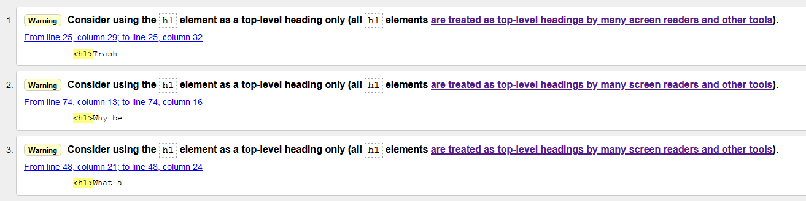
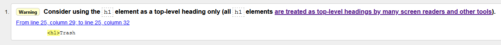
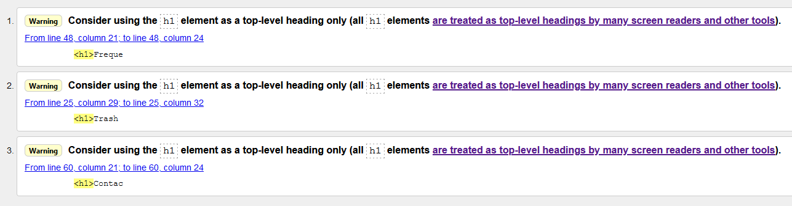
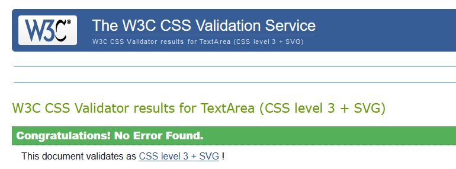

## Testing

### Code validators

I used [w3.org's validator](https://validator.w3.org/) for my HTML validation checks.

Home page (index.html)

About page (about.html)

Tournaments page (tournaments.html)

Contact page (contact.html)

+ The only warning received across all pages was about using h1 as a top level element only.
    + The warning was ignored as they were design decisions.

I used [w3.org's validator](https://jigsaw.w3.org/css-validator/) for my CSS validation checks.

CSS (style.css)

+ No errors were found within the document.

### Responsiveness

To test the responsiveness of the site I used [Chrome DevTools](https://developers.google.com/web/tools/chrome-devtools) and [Responsive Design Checker](https://www.responsivedesignchecker.com/).

Responsiveness (website layout)

|           All Pages           | Samsung 9+ | Galaxy S5  | iPhone 6/7/8 | iPhone X | iPad | iPad Pro | Desktop 1024px | Desktop >1200px |
|:-----------------------------:|------------|------------|--------------|----------|------|----------|----------------|-----------------|
| Website is  responsive >800px |     N/A    |    N/A     |      N/A     |    N/A   | Good |   Good   |      Good      |       Good      |
| Website is  responsive <799px |    Good    |    Good    |     Good     |   Good   |  N/A |    N/A   |       N/A      |       N/A       |
|                               |            |            |              |          |      |          |                |                 |
| **index.html**                |            |            |              |          |      |          |                |                 |
| Links/URLs                    |    Good    |    Good    |     Good     |   Good   | Good |   Good   |      Good      |      Good       |
| Images                        |    Good    |    Good    |     Good     |   Good   | Good |   Good   |      Good      |      Good       |
| Renders as expected           |    Good    |    Good    |     Good     |   Good   | Good |   Good   |      Good      |      Good       |
|                               |            |            |              |          |      |          |                |                 |
| **about.html**                |            |            |              |          |      |          |                |                 |
| Links/URLs                    |    Good    |    Good    |     Good     |   Good   | Good |   Good   |      Good      |      Good       |
| Images                        |    Good    |    Good    |     Good     |   Good   | Good |   Good   |      Good      |      Good       |
| Renders as expected           |    Good    |    Good    |     Good     |   Good   | Good |   Good   |      Good      |      Good       |
|                               |            |            |              |          |      |          |                |                 |
| **tournaments.html**          |            |            |              |          |      |          |                |                 |
| Links/URLs                    |    Good    |    Good    |     Good     |   Good   | Good |   Good   |      Good      |      Good       |
| Images                        |    Good    |    Good    |     Good     |   Good   | Good |   Good   |      Good      |      Good       |
| Renders as expected           |    Good    |    Good    |     Good     |   Good   | Good |   Good   |      Good      |      Good       |
|                               |            |            |              |          |      |          |                |                 |
| **contact.html**              |            |            |              |          |      |          |                |                 |
| Links/URLs                    |    Good    |    Good    |     Good     |   Good   | Good |   Good   |      Good      |      Good       |
| Images                        |    Good    |    Good    |     Good     |   Good   | Good |   Good   |      Good      |      Good       |
| Renders as expected           |    Good    |    Good    |     Good     |   Good   | Good |   Good   |      Good      |      Good       |

Notes:

+ Through the use of vertical width in my font sizes and containers the site is responsive on all screen sizes I've tested personally. There may be slight issues on certain abstract displays; cinema screens etc that might need additional media queries as I experienced minor issues in the development of the project pertaining to content being too big for the viewport.

### Browser Compatibility

I tested the appearance and responsiveness of the website across 5 different browsers and varying browser sizes and these are my results.

|    All Pages   | Firefox | Chrome |  IE  | Edge | Opera |
|:--------------:|:-------:|:------:|:----:|:----:|:-----:|
| Appearance     |   Good  |  Good  | Good | Good |  Good |
| Responsiveness |   Good  |  Good  | Good | Good |  Good |

Notes:

+ Everything functions as expected and no issues that I could find.

### Testing User stories

- #### First Time Visitor Goals    

    + As a **first time user** I want to be able navigate through the whole site smoothly.
        + Wherever a user is on the website, the navigation is in a fixed place at the top of the site.
        + On smaller devices upon pressing the menu icon the user will see all the pages on the site and an associated icon.
    + As a **first time user** I want to understand the purpose of the site upon loading it.
        + Upon loading the site the user will land on index.html and be greeted with the header "Looking for a new kind of Rocket League experience?"
        + There is 3 subheaders and an intro paragraph to give the user some more information on the websites purpose and directs them to press the button below.
        + The button expands the website overview which shows a description of and a link to each page of the site.
    + As a **first time user** I want to be able to easily view information about the discord on any screen size.
        + I have tested the website across multiple screen sizes and have found no issues thus far.
        + The index page provides all the essential information a first time user could require about the discord. 
    + As a **first time user** I want to easily be able to find a community to play rocket league with.
        + In the header you see the brands motto "Community, redefined." which tells the user the website is about a community.
        + The first header you see talks about Rocket League and combined with the first point tells the user they can find a community to play Rocket League with.
    + As a **first time user** I want to find out if other people have had experience with this website/discord.
        + In the overview section of index.html there's a description for the about page that includes "read reviews from some of our players" which directs them to about.html.
        + Once on about.html the user can view player feedback which contains 4 reviews from players within the Trash Tournaments community.
    + As a **first time user** I want to find information about upcoming tournaments
        + In the overview section of index.html there's a description for the tournament page that includes "contains all tournament info" which directs them to tournaments.html.
        + Once on tournaments.html the user can view the tournament timeline which shows times, dates and a brief description of each tournament.
    + As a **first time user** I want to be able to contact the site owners for more information
        + In the overview section of contact.html there's a description for the FAQ/contact page that includes "help answer your questions or contact us further" which directs them to contact.html.
        + Once on contact.html the user may have their answer resolved by the FAQ or they can fill out a form with their name, email and query to submit to the owners.
        + In the footer the left section contains "Contact us here, Get in touch" which redirects the user to contact.html which can be used across all pages.

- #### Site Owner Goals

    + As a **site owner** I want the landing page (index.html) to clearly provide all information needed about the sites purpose and what is available.
        + When I visit the website I can see the intro section and expand button clearly.
        + In the overview section I can find out about every page within the site and see what is being offered to me.
    + As a **site owner** I want any user to receive the correct information for the viewport they’re currently on.
        + I have tested the website across multiple screen sizes and have found no issues thus far with content displaying or appearing incorrectly.
        + The "Menu" text doesn't show on larger devices as intended.
    + As a **site owner** I want users to clearly see there are people willing to play with and help them improve at rocket league.
        + On about.html there is a section displaying our main community principles which encapsulates that we're welcoming and have a vast amount of game knowledge we're willing to share.
    + As a **site owner** I want an organized, intuitive navigation system across all pages.
        + The navigation menu on larger devices is positioned well and provides clear identification to the user about which page they're currently on and which link they're hovering over.
        + The navigation menu on smaller devices is:
        + Positioned well and can open/collapse efficiently.
        + Uses a Trash Can in the same style as the logo with the conventional 3 menu lines (with accompanying text).
        + Provides clear identification to the user about which page they're currently on.
    + As a **site owner** I want users to see input from people who’ve participated and their respective ranks.
        + On about.html users can read reviews from players within our community and their rank is displayed after their name.
    + As a **site owner** I want to include information of upcoming tournaments with conversions for major time zones.
        + On tournaments.html users can view the tournament timeline which displays the times of the next 4 tournaments to occur.
        + Underneath the main intro paragraph on the timeline there is a disclaimer that times are posted in GMT and includes a link to a timezone converter tool.
    + As a **site owner** I want any user to be able to easily contact me with their details and query for more information.
        + On contact.html there is a form that can be filled out with a users name, eamil and query which can be sent to the owner upon the user pressing the submit button.
        + There is validation on the form too to prevent junk query submissions.

### Bugs

+ The first bug I encountered was my background image not showing up when I pushed the code to github pages.
    + This was due to a faulty file path where I had a / which caused it to look for the image at the root of the current web rather than the current folder.

[Return to README.md](README.md).