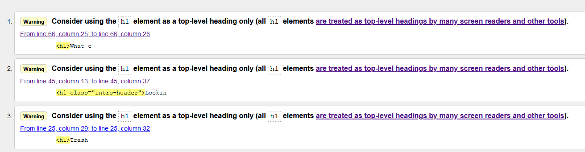

## Testing

### Code validators

I used [w3.org's validator](https://validator.w3.org/) for my HTML validation checks.

Home page (index.html)



About page (about.html)


Tournaments page (tournaments.html)


Contact page (contact.html)


+ The only warning received across all pages was about using h1 as a top level element only.
    + The warning was ignored as they were design decisions.

Upon reflection I ended up reorganizing my code and adding in classes to scale my elements instead of using heading elements.

Here is my updated testing of my HTML code;

Home page (index.html)


About page (about.html)


Tournaments page (tournaments.html)


Contact page (contact.html)


Error 404 page (404.html)


I used [w3.org's validator](https://jigsaw.w3.org/css-validator/) for my CSS validation checks.

CSS (style.css)


+ No errors were found within the document.

### Responsiveness

To test the responsiveness of the site I used [Chrome DevTools](https://developers.google.com/web/tools/chrome-devtools), [Firefox Devtools](https://developer.mozilla.org/en-US/docs/Tools) and [Responsive Design Checker](https://www.responsivedesignchecker.com/).

Responsiveness (website layout)

|           All Pages           | Samsung 9+ | Galaxy S5  | iPhone 6/7/8 | iPhone X | iPad | iPad Pro | Desktop 1024px | Desktop >1200px |
|:-----------------------------:|------------|------------|--------------|----------|------|----------|----------------|-----------------|
| Website is  responsive >800px |     N/A    |    N/A     |      N/A     |    N/A   | Good |   Good   |      Good      |       Good      |
| Website is  responsive <799px |    Good    |    Good    |     Good     |   Good   |  N/A |    N/A   |       N/A      |       N/A       |
|                               |            |            |              |          |      |          |                |                 |
| **index.html**                |            |            |              |          |      |          |                |                 |
| Links/URLs                    |    Good    |    Good    |     Good     |   Good   | Good |   Good   |      Good      |      Good       |
| Images                        |    Good    |    Good    |     Good     |   Good   | Good |   Good   |      Good      |      Good       |
| Renders as expected           |    Good    |    Good    |     Good     |   Good   | Good |   Good   |      Good      |      Good       |
|                               |            |            |              |          |      |          |                |                 |
| **about.html**                |            |            |              |          |      |          |                |                 |
| Links/URLs                    |    Good    |    Good    |     Good     |   Good   | Good |   Good   |      Good      |      Good       |
| Images                        |    Good    |    Good    |     Good     |   Good   | Good |   Good   |      Good      |      Good       |
| Renders as expected           |    Good    |    Good    |     Good     |   Good   | Good |   Good   |      Good      |      Good       |
|                               |            |            |              |          |      |          |                |                 |
| **tournaments.html**          |            |            |              |          |      |          |                |                 |
| Links/URLs                    |    Good    |    Good    |     Good     |   Good   | Good |   Good   |      Good      |      Good       |
| Images                        |    Good    |    Good    |     Good     |   Good   | Good |   Good   |      Good      |      Good       |
| Renders as expected           |    Good    |    Good    |     Good     |   Good   | Good |   Good   |      Good      |      Good       |
|                               |            |            |              |          |      |          |                |                 |
| **contact.html**              |            |            |              |          |      |          |                |                 |
| Links/URLs                    |    Good    |    Good    |     Good     |   Good   | Good |   Good   |      Good      |      Good       |
| Images                        |    Good    |    Good    |     Good     |   Good   | Good |   Good   |      Good      |      Good       |
| Renders as expected           |    Good    |    Good    |     Good     |   Good   | Good |   Good   |      Good      |      Good       |


Notes:

+ Through the use of vertical width in my font sizes and containers the site is responsive on all screen sizes that I have tested personally. There may be slight issues on certain abstract displays that might need additional media queries as I experienced minor issues in the development of the project pertaining to content being too big for the viewport.

### Browser Compatibility

I tested the appearance and responsiveness of the website across 5 different browsers and varying browser sizes and these are my results:

|    All Pages   | Firefox | Chrome |  IE  | Edge | Opera |
|:--------------:|:-------:|:------:|:----:|:----:|:-----:|
| Appearance     |   Good  |  Good  | Good | Good |  Good |
| Responsiveness |   Good  |  Good  | Good | Good |  Good |

Notes:

+ Everything functions as expected and no issues that I could find.

### Testing User stories

- #### First Time Visitor Goals    

    + As a **first time user** I want to be able to navigate through the whole site smoothly.
        + Wherever a user is on the website, the navigation is in a fixed place at the top of the site.
        + On smaller devices upon pressing the menu icon the user will see all the pages on the site and an associated icon.
    + As a **first time user** I want to understand the purpose of the site upon loading it.
        + Upon loading the site the user will land on index.html and be greeted with the header "Looking for a new kind of Rocket League experience?"
        + There are 3 subheaders and an intro paragraph to give the user some more information on the website's purpose and directs them to press the button below.
        + The button expands the website overview which shows a description of and a link to each page of the site.
    + As a **first time user** I want to be able to easily view information about the Discord on any screen size.
        + I have tested the website across multiple screen sizes and have found no issues thus far.
        + The index page provides all the essential information a first time user could require about the Discord. 
    + As a **first time user** I want to easily be able to find a community to play [Rocket League](https://www.rocketleague.com/) with.
        + In the header you see the brands motto "Community, redefined" which tells the user the website is about a community.
        + The first header you see talks about Rocket League and combined with the first point tells the user they can find a community to play Rocket League with.
    + As a **first time user** I want to find out if other people have had experience with this website/Discord.
        + In the overview section of index.html there is a description for the about page that includes "read reviews from some of our players" which directs them to about.html.
        + Once on about.html the user can view player feedback which contains 4 reviews from players within the Trash Tournaments community.
    + As a **first time user** I want to find information about upcoming tournaments.
        + In the overview section of index.html there is a description for the tournament page that includes "contains all tournament info" which directs them to tournaments.html.
        + Once on tournaments.html the user can view the tournament timeline which shows times, dates and a brief description of each tournament.
    + As a **first time user** I want to be able to contact the site owners for more information.
        + In the overview section of contact.html there is a description for the FAQ/contact page that includes "help answer your questions or contact us further" which directs them to contact.html.
        + Once on contact.html the user may have their answer resolved by the FAQ or they can fill out a form with their name, email and query to submit to the owners.
        + In the footer the left section contains "Contact us here/Get in touch" which redirects the user to contact.html which can be used across all pages.

- #### Site Owner Goals

    + As a **site owner** I want the landing page (index.html) to clearly provide all information needed about the site's purpose and what is available.
        + When I visit the website I can see the intro section and expand button clearly.
        + In the overview section I can find out about every page within the site and see what is being offered to me.
    + As a **site owner** I want any user to receive the correct information for the viewport they are currently on.
        + I have tested the website across multiple screen sizes and have found no issues thus far with content displaying or appearing incorrectly.
        + The "Menu" text does not show on larger devices as intended.
    + As a **site owner** I want users to clearly see there are people willing to play with and help them improve at [Rocket League](https://www.rocketleague.com/).
        + On about.html there is a section displaying our main community principles which encapsulates that we are welcoming and have a vast amount of game knowledge we are willing to share.
    + As a **site owner** I want an organized, intuitive navigation system across all pages.
        + The navigation menu on larger devices is positioned well and provides clear identification to the user about which page they are currently on and which link they are hovering over.
        + The navigation menu on smaller devices is:
            + Positioned well and can open/collapse efficiently.
            + Uses a Trash Can in the same style as the logo with the conventional 3 menu lines (with accompanying text).
            + Provides clear identification to the user about which page they are currently on.
    + As a **site owner** I want users to see input from people who have participated and their respective ranks.
        + On about.html users can read reviews from players within our community and their rank is displayed after their name.
    + As a **site owner** I want to include information of upcoming tournaments with conversions for major time zones.
        + On tournaments.html users can view the tournament timeline which displays the times of the next 4 occuring tournaments.
        + Underneath the main intro paragraph on the timeline there is a disclaimer that times are posted in GMT and includes a link to a timezone converter tool.
    + As a **site owner** I want any user to be able to easily contact me with their details and query for more information.
        + On contact.html there is a form that can be filled out with a user's name, email and query which can be sent to the owner upon the user pressing the submit button.
        + There is validation on the form too to prevent junk query submissions.

### Bugs

+ When adding my background image it did not show up when I pushed the code to Github pages.
    + To solve this I found out it was due to a faulty file path where I had a / which caused it to look for the image at the root of the current web rather than the current folder.

+ When adding the nav menu, the navbar-nav element was positioned fine on mobile but when going to desktop view it was pushed all the way to the right which was not intended in the design.
	+ To solve this I added ```margin: auto;``` to the navbar-nav element.

+ When I was adding the footer icons I set them to be of relative position and bottom set to 1vh which caused a bug later down the line where the icons were appearing outside of the footer container.
	+ To solve this I removed the 2 aforementioned property types.

+ From a previous attempt to style the footer container I was using vw to make it stretch to the size I wanted. At the current point of the development process it was appearing huge on desktop view so I added a max-height of 10vh. This ended up causing a bug later on where content was appearing outside of the footer on large devices because it was making the container smaller than needed for content size.
	+ To solve this I removed the max-height property as the new design was not causing the issue I originally experienced.

+ The h1 element in my header was pushing some of the other header elements on medium devices.
	+ To solve this I added ```margin: 0;``` to .brand-title class which allowed for content to be displayed better and stopped content overlapping/coming out of the header.

+ When adding the header title and motto to the header, a bug occured involving my navbar. I had it positioned relatively with a top value of 3.5vh for medium devices which caused the navbar to appear outside of the header.
	+ To solve this I lowered it to 2.85vh and the nav bar now functions as intended across devices.
	+ I also added a 1.5vh top margin to .header-title on large devices to stop it being pushed to the top of the header.

+ When viewing the signup guide on small devices it was indenting and only showing on the right hand side of the container.
	+ To solve this I added my own left padding of 1vw which displayed the content as intended.

[Return to README.md](README.md).